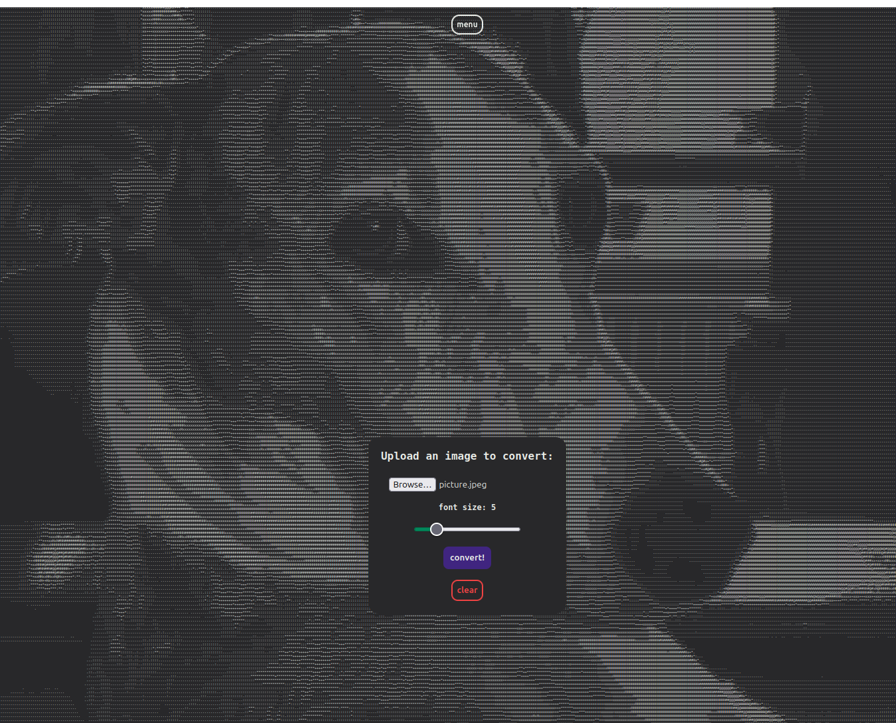

# image2ascii-web

This is a very simple web ui to convert images to text by calculating each pixel's
brightness level. It does not serve much of a purpose, but it was fun to make.

The frontend is build in simple `html`/`css`, and the image conversion logic is implemented in `Rust` and compiled to 
`WebAssembly`.



---

## How to build
To build and run this project yourself, you will only need to do two things:
1. Compile the `Rust` code to `WebAssembly`.
2. Host the `index.html` file via some server. It should have access to the `pkg/` directory.

First, to compile the Rust code to WebAssembly, you need to first install the Rust compiler and the `cargo` package manager.
You will also need the `wasm-pack` tool, this can be installed using cargo:
```shell
cargo install wasm-pack
```
Now to compile the Rust code to WebAssembly, use the following:
```shell
wasm-pack build --target web
```

Secondly, it is necessary to host the application via a server in order for the WebAssembly to be able to run. There is one 
simple way to do this using `Python` and it's `http` library. We can use the following shell command to run a simple 
file server using Python:

```shell
# Run this in the same directory as the index.html file

# linux / MacOS:
python3 -m http.server

# windows:
python -m http.server
```
